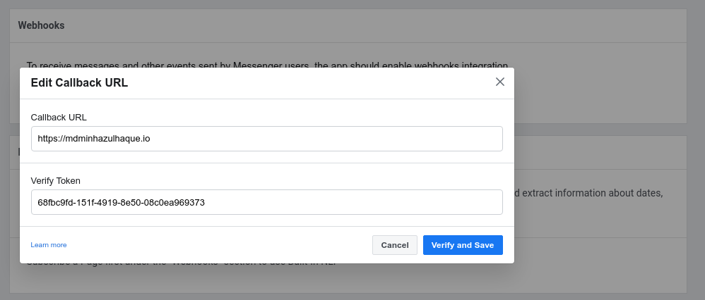

# Build a Messenger Bot using Flask

## Create an App

First thing first. You will need one Facebook app. Go to [Developers](https://developers.facebook.com/apps/) page and create one. Let's name it `Minhaz App`.

Next you will need to choose what type of product you want to integrate this app with. Let's choose *Messenger*.


After you select *Messenger*, navigate to the *Webhook* seciton. Click *Add Callback URL*.


## Setup Flask App

Now we need to setup a simple webserver that respond to Facebook's requests. I have attached one sample `app.py`. Copy it to your webserver.

Before finishing this step, you will need one Token that will be used to verify your webserver by Facebook. I used `uuidgen` command to generate one and put as `VERIFY_TOKEN` in `app.py`.

When done, leave your Flask app running. Make sure the port is accessible from the internet. Also Facebook requires SSL to be enabled. You can either use Let's Encrypt to get free SSL certificates. Or in case you already have a set of certificates, just point to them as `ssl_context` in `app.py`.

If more help is needed on Let's Encrypt vs Flask, navigate to [Run Flask App with Let's Encrypt SSL Certificate](https://bits.mdminhazulhaque.io/python/run-flask-app-with-let's-encrypt-ssl-certificate.html)

## Finish Setting Up Facebook App

Okay, let's get back to Facebook part. Put the webserver's Hostname (IP will not work) as well as the Token you generated.



If the Flask app is running and all good, Facebook should show success screen. A message like the following will appear in Flask debug log.

```
root@mdminhazulhaque:~# python app.py
 * Serving Flask app "app" (lazy loading)
 * Environment: production
   WARNING: This is a development server. Do not use it in a production deployment.
   Use a production WSGI server instead.
 * Debug mode: off
 * Running on https://0.0.0.0:8080/ (Press CTRL+C to quit)
66.220.149.15 - - [10/May/2020 19:36:40] "GET /?hub.mode=subscribe&hub.challenge=2614994616&hub.verify_token=68fbc9fd-151f-4919-8e50-08c0ea969373 HTTP/1.1" 200 -
```

Now we have to allow the app to read messages. Due to security reasons, apps can only be used by the developer unless they are published and satisfies Facebook T&Cs. So we will create a page to allow our app to read message sent to the page. Click *Add New Page* or link an existing page if you have any.


Once page is linked, click on *Generate Token*. Then click *Copy* on the popup screen. Put this string in `app.py` as `PAGE_ACCESS_TOKEN`. Make sure FLask is reloaded.


## Test the App

Now send a message to the page you just created. Facebook should POST the content to the Flask app we made. Our Flask app will return the same string the user sent with prefix `You said`.


You are supposed to see messages like the following which indicates that your app is responding correctly with Facebook's callback.

```
66.220.149.3 - - [10/May/2020 19:41:38] "POST / HTTP/1.1" 200 -
66.220.149.23 - - [10/May/2020 19:41:59] "POST / HTTP/1.1" 200 -
66.220.149.3 - - [10/May/2020 19:42:30] "POST / HTTP/1.1" 200 -
66.220.149.18 - - [10/May/2020 19:43:50] "POST / HTTP/1.1" 200 -
```

Cheers!
